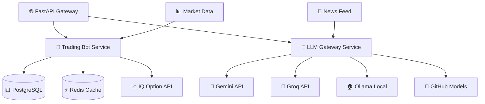

# 🤖 IQ Option Bot API

<div align="center">


**AI-Powered Trading Bot for IQ Option**

*Intelligent trading decisions powered by Large Language Models with enterprise-grade microservices architecture*

[🚀 Quick Start](#-quick-start) • [📚 Documentation](#-documentation) • [🛠️ Development](#-development) • [🏗️ Architecture](#-architecture)

</div>

---

## ✨ Features

<table>
<tr>
<td width="50%">

### 🧠 **AI-Powered Intelligence**
- 🤖 Multiple LLM providers (Gemini, Groq, Ollama, GitHub Models)
- 📊 Real-time market sentiment analysis  
- 🎯 Smart trading signal generation
- 📈 Custom technical indicators integration

</td>
<td width="50%">

### 🏗️ **Enterprise Architecture**
- 🔄 Microservices-based design
- ⚡ Asynchronous processing with Redis
- 🗄️ PostgreSQL data persistence
- 🐳 Docker containerization ready

</td>
</tr>
<tr>
<td width="50%">

### 📱 **Trading Features**
- 💹 IQ Option API integration
- 🕒 Configurable trading sessions
- 💰 Risk management controls
- 📊 Multiple timeframe analysis

</td>
<td width="50%">

### 🛡️ **Safety & Monitoring**
- 🎮 Demo mode for safe testing
- 📊 Real-time performance metrics
- ⚠️ Automated stop-loss protection
- 📝 Comprehensive logging system

</td>
</tr>
</table>

## 🚀 Quick Start

### Prerequisites
- Python 3.9+
- Docker & Docker Compose
- IQ Option account (demo recommended for testing)

### Installation

```bash
# 1️⃣ Clone the repository
git clone https://github.com/Trafexofive/iq-option-bot-api.git
cd iq-option-bot-api

# 2️⃣ Set up environment
cp .env.example .env
# Edit .env with your configuration

# 3️⃣ Start all services
make up

# 4️⃣ Verify installation
make status
```

### 🎯 First Trade
```bash
# Start the bot in demo mode
make start-demo

# Monitor real-time logs
make logs

# Check trading performance
make stats
```

## 🏗️ Architecture

<div align="center">



</div>

### 🔧 Core Services

| Service | Port | Description | Tech Stack |
|---------|------|-------------|------------|
| 🤖 **Trading Bot** | 8000 | Core trading logic & IQ Option integration | FastAPI, SQLAlchemy, Celery |
| 🧠 **LLM Gateway** | 8001 | Unified AI interface with failover | FastAPI, HTTPX, AsyncIO |
| 📊 **Market Data** | 8002 | Real-time data processing | WebSockets, Pandas |
| 🔄 **Background Worker** | - | Async trade execution | Celery, Redis |

## 📁 Project Structure

```
iq-option-bot-api/
├── 🤖 services/
│   ├── trading-bot/          # Core trading service
│   └── llm_gateway/          # AI gateway service
├── 📊 benchmarking/          # Performance tests
├── 📚 docs/                  # Documentation
├── 🎯 examples/              # Usage examples
├── 🏗️ infra/                # Infrastructure configs
├── 🎨 prompts/               # LLM prompt templates
├── 🔧 scripts/               # Utility scripts
├── 🧪 testing/               # Integration tests
└── ⚙️ settings.yml           # Global configuration
```

## 🛠️ Development

### Local Development Setup

```bash
# Install development dependencies
pip install -r requirements.txt

# Set up pre-commit hooks
pre-commit install

# Run linting and formatting
make lint
make format

# Run comprehensive tests
make test-all
```

### 🐳 Docker Development

```bash
# Build all services
make build

# Run in development mode
make dev

# Hot reload enabled
make watch
```

## ⚙️ Configuration

### Environment Variables

Create your `.env` file based on `.env.example`:

```bash
# IQ Option Configuration
IQ_OPTION_EMAIL=your.email@example.com
IQ_OPTION_PASSWORD=your_password
IQ_OPTION_DEMO=true

# LLM Provider API Keys
GEMINI_API_KEY=your_gemini_key
GROQ_API_KEY=your_groq_key
GITHUB_TOKEN=your_github_token

# Trading Parameters
MAX_DAILY_TRADES=5
TRADE_AMOUNT=1.0
STOP_AFTER_LOSSES=1
```

### Trading Configuration

Customize your trading strategy in `settings.yml`:

```yaml
trading:
  max_daily_trades: 5
  balance_allowed: "10$"
  wake_interval: "2m"
  stop_after_losses: 1
  trade_amount: 1.0
  win_amount_multiplier: 1.7
  
  trading_hours:
    start: "09:00"
    end: "17:00"
    
  timeframes:
    - "M1"
    - "M5" 
    - "M15"
    
  context_feeds:
    - "RSI"
    - "MACD"
    - "BollingerBands"
```

## 📊 Monitoring & Analytics

### Real-time Dashboard
```bash
# Access trading dashboard
open http://localhost:8000/dashboard

# View performance metrics
make metrics

# Export trading history
make export-trades
```

### 📈 Performance Tracking
- Win/Loss ratios
- Daily P&L analysis
- Risk metrics monitoring
- LLM response analytics

## 🤝 Contributing

We welcome contributions! Here's how to get started:

1. 🍴 **Fork** the repository
2. 🌿 **Create** a feature branch (`git checkout -b feature/amazing-feature`)
3. ✏️ **Commit** your changes (`git commit -m 'Add amazing feature'`)
4. 📤 **Push** to the branch (`git push origin feature/amazing-feature`)
5. 🔄 **Open** a Pull Request

### Development Guidelines
- Follow PEP 8 style guidelines
- Add tests for new features
- Update documentation as needed
- Ensure all CI checks pass

## 📚 Documentation

- [📖 API Documentation](./docs/api.md)
- [🔧 Setup Guide](./docs/setup.md) 
- [🏗️ Architecture Overview](./docs/architecture.md)
- [🤖 Trading Strategies](./docs/strategies.md)
- [🐛 Troubleshooting](./docs/troubleshooting.md)

## 🛡️ Security & Risk Management

⚠️ **Important Disclaimers:**
- Always start with demo mode
- Never trade more than you can afford to lose
- Review and understand all trading parameters
- Monitor bot performance regularly
- Keep API keys secure and never commit them

## 📄 License

This project is licensed under the MIT License - see the [LICENSE](LICENSE) file for details.

## 🌟 Star History

[](https://star-history.com/#Trafexofive/iq-option-bot-api&Date)

---

<div align="center">

**Made with ❤️ by developers, for developers**

[Report Bug](https://github.com/Trafexofive/iq-option-bot-api/issues) • [Request Feature](https://github.com/Trafexofive/iq-option-bot-api/issues) • [Join Discord](https://discord.gg/your-discord)

</div>